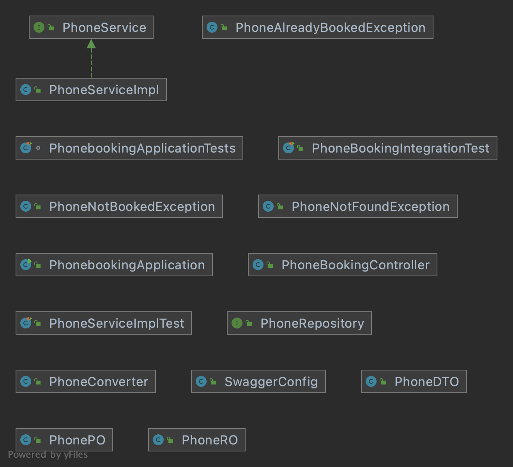
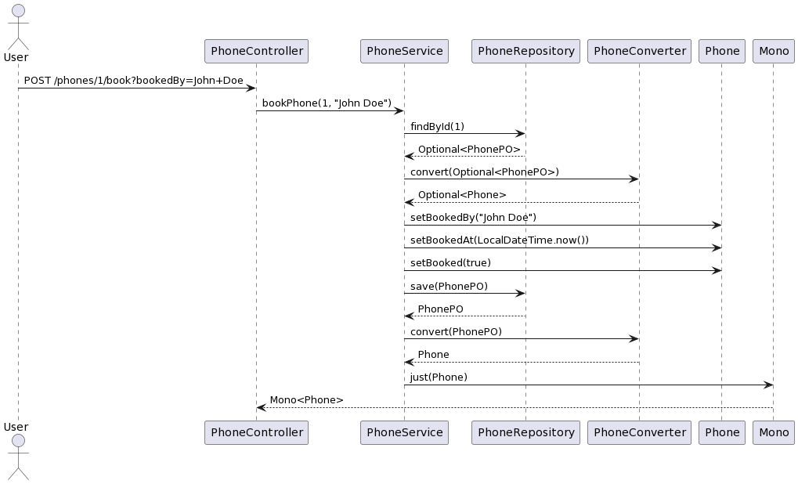
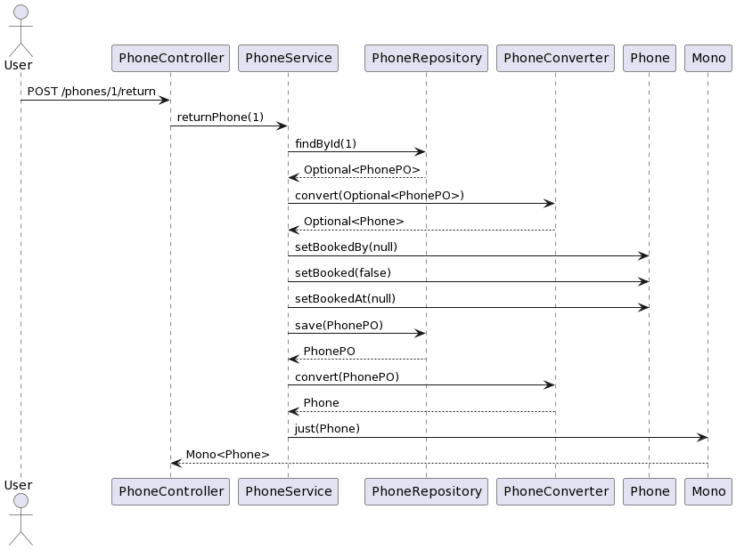

# Phone Booking Service
This is a sample Spring Boot application that provides a RESTful API for booking and returning mobile phones.

# Technologies Used
* Java
* Spring Boot
* Spring WebFlux
* Spring Data JPA
* H2 Database
* Testcontainers
* Flyway
* Lombok
* JUnit 5
* Mockito
* Swagger
# Getting Started
## Prerequisites
* Java 17
* Docker (optional)
## Building
```
./gradlew build
```
## Running
```
java -jar build/libs/phonebooking-0.0.1-SNAPSHOT.jar
```
Or with Docker:

```
docker build -t phone/booking .
docker run -p 8080:8080 phone/booking
```
## API Documentation
Swagger documentation is available at http://localhost:8080/swagger-ui/

## API Endpoints

* GET /phones: returns a list of all phones
* POST /phones/{id}/book?bookedBy={name}: books the phone with the given ID and sets the bookedBy field to name
* POST /phones/{id}/return: returns the phone with the given ID by setting the booked field to false and the bookedBy field to null
## Architecture
The application is structured using a layered architecture, with the following layers:

* Controller layer: handles incoming requests and outgoing responses
* Service layer: contains business logic and coordinates interactions between the controller and repository layers
* Repository layer: interacts with the database

The application uses Spring Data JPA for database access, and Testcontainers for integration testing with an H2 database. Flyway is used for database migrations.

# Examples
### Book a phone:

```
Request:
POST /phones/1/book?bookedBy=John+Doe HTTP/1.1
Host: example.com

Response:
HTTP/1.1 200 OK
Content-Type: application/json

{
"id": 1,
"brand": "Samsung",
"model": "Galaxy S9",
"booked": true,
"bookedAt": "2022-05-01T12:00:00",
"bookedBy": "John Doe"
}
```

### Return a phone:

```
Request:
POST /phones/1/return HTTP/1.1
Host: example.com

Response:
HTTP/1.1 200 OK
Content-Type: application/json

{
"id": 1,
"brand": "Samsung",
"model": "Galaxy S9",
"booked": false,
"bookedAt": null,
"bookedBy": null
}
```

### Get all phones:

```
Request:
GET /phones HTTP/1.1
Host: example.com

Response:
HTTP/1.1 200 OK
Content-Type: application/json

[
{
"id": 1,
"brand": "Samsung",
"model": "Galaxy S9",
"booked": false,
"bookedAt": null,
"bookedBy": null
},
{
"id": 2,
"brand": "Apple",
"model": "iPhone 13",
"booked": true,
"bookedAt": "2022-05-01T12:00:00",
"bookedBy": "Jane Doe"
},
...
]
```

# UML
## Class diagram

## Phone booking

## Phone returning


# Reflection

### What aspect of this exercise did you find most interesting?
I found the most interesting aspect of this exercise to be developing a microservice from scratch, as it allowed me to revisit some concepts that I may have forgotten over time.
### What did you find most cumbersome?
The most cumbersome part was encountering issues with starting testcontainers, which caused some delays. Other than that, it was just a matter of time and effort to complete the exercise.
